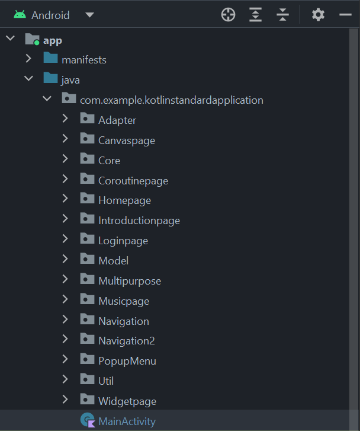
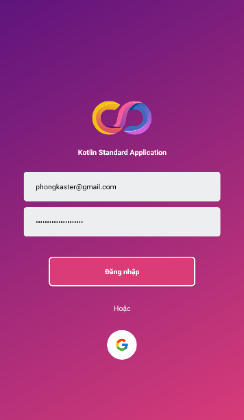
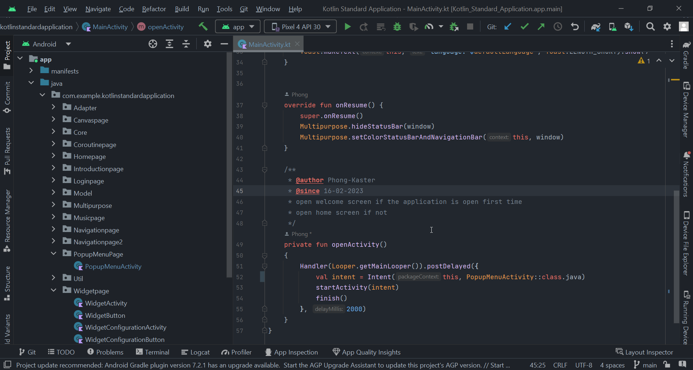

<h1 align="center">Kotlin Standard Application 
    Basic and easy-to-learn examples about Android Components
</h1>

    

# [**Table Of Content**](#table-of-content)
- [**Table Of Content**](#table-of-content)
- [**Introduction**](#introduction)
- [**Structure**](#structure)
- [**Package**](#package)
  - [**Canvaspage**](#canvaspage)
  - [**Coroutinepage**](#coroutinepage)
  - [**Homepage**](#homepage)
  - [**Introductionpage**](#introductionpage)
  - [**Loginpage**](#loginpage)
  - [**Musicpage**](#musicpage)
  - [**Navigationpage**](#navigationpage)
  - [**Navigationpage 2**](#navigationpage-2)
  - [**Pop-up Menu Page**](#pop-up-menu-page)
  - [**Widgetpage**](#widgetpage)
- [**Usage**](#usage)
- [**Made with 💘 and Kotlin**](#made-with--and-kotlin)

# [**Introduction**](#introduction)

This is my practices basing on [**Official Document**](#) from Google for Android Developers. All my practices are easy-to-learn so that you guys can take them as example if you are a newcomer in Android world.

When i created this project, i were a junior Android programmer. To easy to explore new knowledge, i have separated what i learnt in different packages like the following photo:

    

<h3 align="center">

***Structure of the project***
</h3>

# [**Structure**](#structure)

As you guys can see on the above pictures. It is easy to guess these packages means for what 😋😋.

- **Adapter** - this folder contains all adapters for the purpose of using Recycler View, Spinner, List View,...
  
- **Folder with `page` suffix** - these folders is the way I separates what topic I learnt. For instance, Coroutinepage is folder that I learnt about Coroutine, Introductionpage stands for creating onboarding screens.... You can find more detail about them below, on section [**Packages**](#package)

- **Core** - this folder where I writes Core Activity, Core Fragment, Core View Model,.... they are parent class that all components extends them have the same operation on functions like onCreate, onDestroy, onResume,... In additional, they also contains boilerplate-code functions like hide system navigation, for example.

- **Model** - this folder includes all class that participate in this project. It plays the role where I define classes in MVVM or MVC architecture

- **Multipurpose** - this folder contains simple functions like convertDateToString, getCurrentYear, getCurrentTime,...

- **Util** - this folder where i sum up blocks of code that are reusable or functions relates to Shared Preferences.

- **Main Activity** - this is the root activity to begin all stuffs above.

# [**Package**](#package)

This section describes what i have practiced in each package having `page` suffix. To easier reading, I am going to describes from above to below.

## [**Canvaspage**](#canvaspage)

Canvas page - the name has described that package having. I just do basic practise about using Canvans in Android. No thing more at all😂😂

## [**Coroutinepage**](#coroutinepage)

In Coroutine page, it includes two important topics in Android:

- Room Data 

- Coroutine

I combined using Room Data with Coroutine to do CREATE - READ - DELETE - EDIT functions.

## [**Homepage**](#homepage)

In Home page, I used ExoPlayer library to stream files have `.m3u8` suffix. I also customized media control layout in this practise.

## [**Introductionpage**](#introductionpage)

In introduction page, I created a standard approach to create onboarding screens for users open the application in the first time.

## [**Loginpage**](#loginpage)

In login page, I just created a simple layout as login screen and set up events when users click on buttons.

    

<h3 align="center">

***Login screen***
</h3>

## [**Musicpage**](#musicpage)

In music page, I created a music player by using notification as foreground service combining Broadcast Receiver to listen events from users

## [**Navigationpage**](#navigationpage)

In navigation page, following Android Document i using Navigation Components to combine Bottom Navigation View in order to an activity with multiple fragment and the application navigates to fragment using `findNavController.navigate` function.

## [**Navigationpage 2**](#navigationpage-2)

In navigation page 2, i do the same as the above section except i have used Safe Arg plugin to navigate among fragment instead of using `findNavController.navigate` function.

This example is useful if you want to create applications that have only one activity and all screens are fragment. Easier coding, Easier debugging ✌😎

## [**Pop-up Menu Page**](#pop-up-menu-page)

I didn't know how to create a pop-up menu so let's do it.😋

## [**Widgetpage**](#widgetpage)

App widgets are miniature application views that can be embedded in other applications (such as the home screen of device) and receive periodic updates.

# [**Usage**](#usage)

To see what i do in each package, do the following steps:

1. Clone this repository and open it with Android Studio

2. Open Main Activity

3. Replace Popup Menu Activity with the one that you want to see
   

    

<h3 align="center">

***Pay attention to line 52, replace Popup Menu Activity with the activity that you want to see***
</h3>

4. Build the application and enjoy this moment

# [**Made with 💘 and Kotlin**](#made-with-love-and-kotlin)